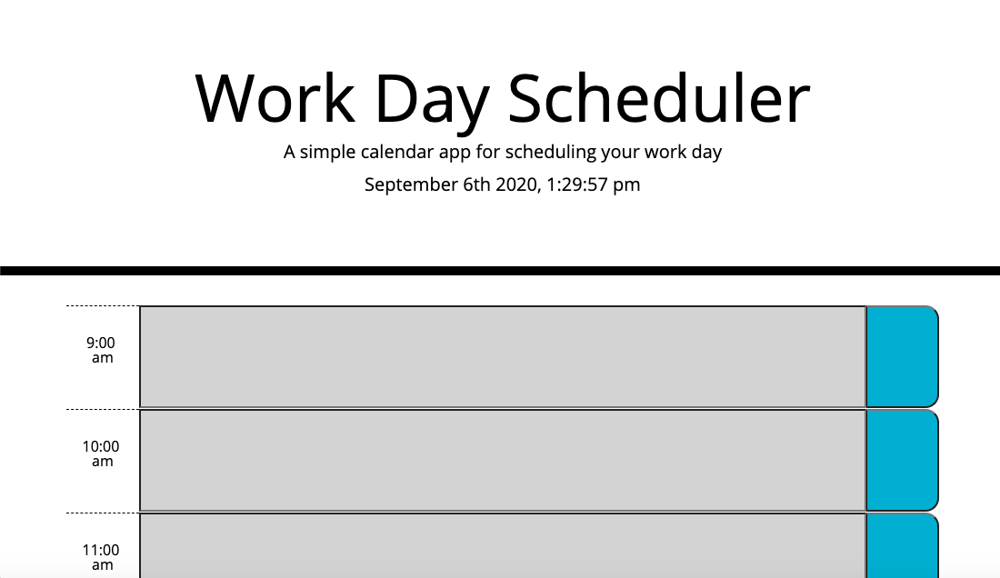
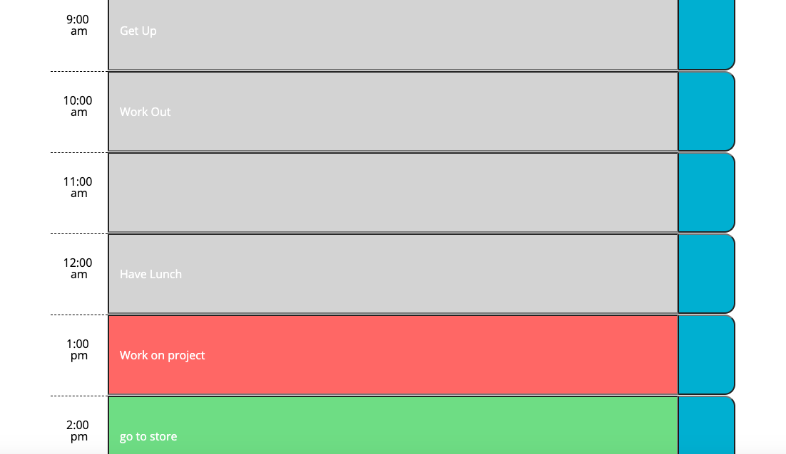
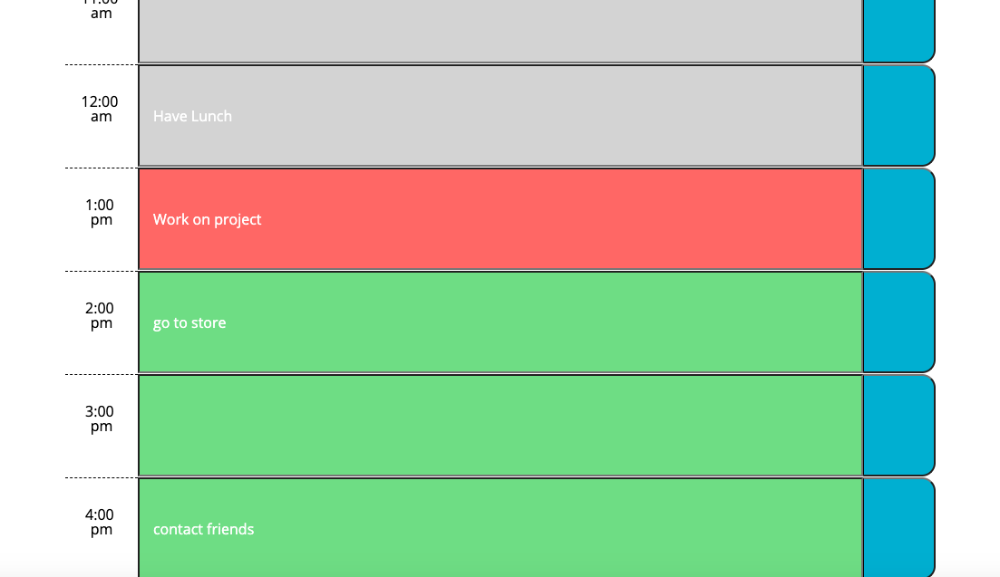

# Calendar-app-ak

## Description

A calendar application that allows the user to update and save events for daily use.
The application runs in the browser and is color coded to the current time of day.
There is also timer in the header that displays the current time and date. 

## Web Link
Visit deplyed project at:https://aken00.github.io/Calendar-app-ak/

